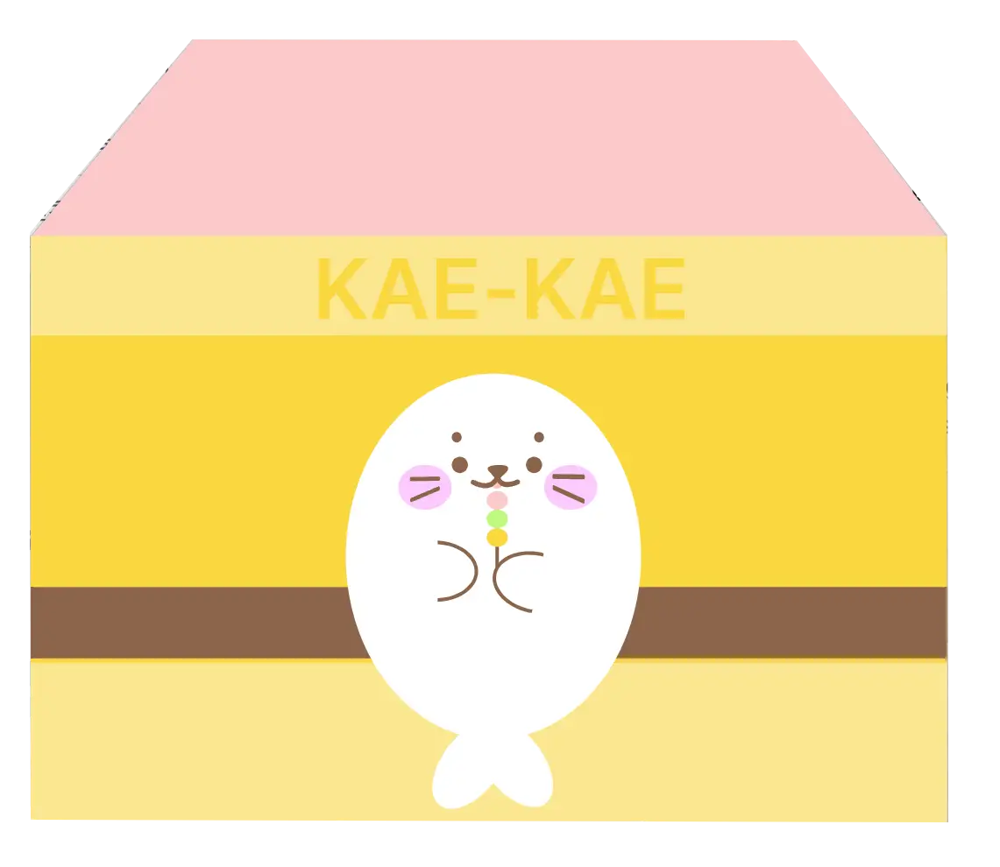

# KaeKae Widget 🦭

[](https://www.electronjs.org/)



KaeKae Widget은 귀여운 물개 캐릭터와 함께하는 데스크톱 위젯입니다. 노트북만 있다면 언제 어디서나 당신의 작업 공간에 즐거움을 더해줄 거예요!

## 주요 기능

- 🖥️ 항상 데스크톱에 떠 있는 귀여운 물개 친구
- 💻 노트북 사용자를 위한 최적화
- 🎨 (추가 기능 설명...)

## 설치 방법

1. 이 저장소를 클론합니다:
   ```
   git clone https://github.com/your-username/kaekae-widget.git
   ```
2. 프로젝트 디렉토리로 이동합니다:
   ```
   cd kaekae-widget
   ```
3. 필요한 의존성을 설치합니다:
   ```
   npm install
   ```
4. 애플리케이션을 실행합니다:
   ```
   npm start
   ```

## 기술 스택

- [Electron.js](https://www.electronjs.org/): 크로스 플랫폼 데스크톱 애플리케이션 개발을 위한 프레임워크

## 기여하기

물개 캐릭터를 사랑하는 여러분의 기여를 환영합니다! 이슈를 제기하거나 풀 리퀘스트를 보내주세요.

## 라이선스

이 프로젝트는 [MIT 라이선스](LICENSE)하에 있습니다.

---

🦭 물개 캐릭터를 사랑한다면 KaeKae Widget과 함께 즐거운 시간 보내세요! 🦭
